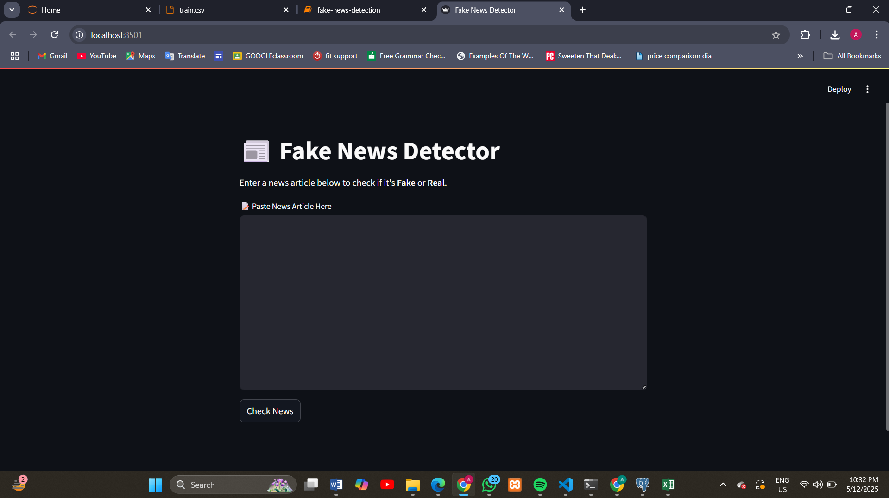
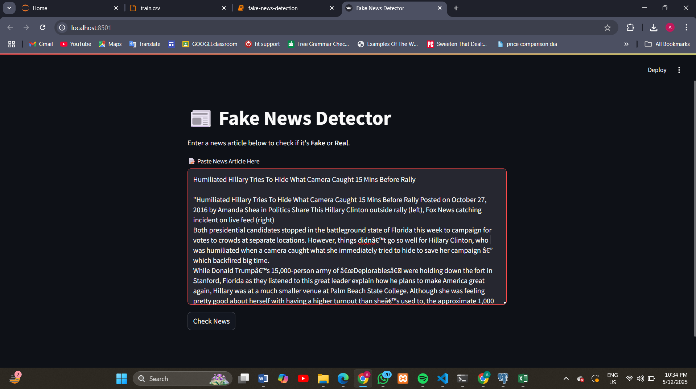

# Fake News Detection System

## Overview
This project aims to develop an automated system for classifying news articles as real or fake using machine learning techniques. The system leverages natural language processing (NLP) and various classification algorithms to detect misinformation in digital news content. The goal is to assist users and organizations in identifying misleading information by analyzing textual features.

## Frontend Preview  
### 1. Input Interface  
Users can paste news articles to check authenticity:  
  

### 2. Fake News Detection Example  
  

  

## Features
- **Text Preprocessing**: Includes lowercasing, noise removal, stopword removal, tokenization, and stemming.
- **Feature Extraction**: Utilizes TF-IDF (Term Frequency-Inverse Document Frequency) to convert text into numerical features.
- **Multiple Classifiers**: Implements four machine learning algorithms:
  - XGBoost
  - Linear SVC (Support Vector Classifier)
  - Random Forest
  - Logistic Regression
- **Evaluation Metrics**: Assesses performance using accuracy, precision, recall, and confusion matrices.
- **Interactive Frontend**: Built with Streamlit for users to input news articles and receive real-time predictions.

## Dataset
The dataset used for training and evaluation is sourced from Kaggle and contains labeled text entries distinguishing between genuine and fake news.  
**Dataset Link**: [Scam Detection Fake News Labelled Dataset](https://www.kaggle.com/datasets/noorsaeed/scam-detection-fake-news-labelled-dataset)

## Methodology
1. **Data Preprocessing**:
   - Cleaned text by removing punctuation, special characters, and stopwords.
   - Applied stemming to reduce words to their root forms.
2. **Feature Extraction**:
   - Transformed text into TF-IDF vectors for model training.
3. **Model Training**:
   - Trained and evaluated four classifiers: XGBoost, Linear SVC, Random Forest, and Logistic Regression.
4. **Performance Evaluation**:
   - Compared models based on accuracy, precision, recall, and confusion matrices.
5. **Frontend Development**:
   - Created an interactive web interface using Streamlit for user input and prediction.

## Results  
### Model Comparison  
| Model               | Accuracy | Precision (0/1) | Recall (0/1) | F1-Score (0/1) |  
|---------------------|----------|-----------------|--------------|----------------|  
| **XGBoost**         | 97%      | 0.98 / 0.97     | 0.97 / 0.98  | 0.97 / 0.97    |  
| **Linear SVC**      | 96%      | 0.97 / 0.96     | 0.96 / 0.97  | 0.97 / 0.97    |  
| **Random Forest**   | 93%      | 0.91 / 0.96     | 0.96 / 0.90  | 0.93 / 0.93    |  
| **Logistic Regression** | 95%  | 0.96 / 0.95     | 0.94 / 0.96  | 0.95 / 0.95    |  

### Key Insights  
- **XGBoost** outperformed others with **97% accuracy** and balanced precision/recall.  
- **Linear SVC** was close behind, ideal for high-dimensional text data.  
- **Random Forest** showed lower recall for fake news (0.90), indicating more false negatives.  

## How to Use
1. **Clone the Repository**:
   ```bash
   git clone https://github.com/your-username/fake-news-detection.git
   cd fake-news-detection
   ```
2. **Install Dependencies**:
   ```bash
   pip install -r requirements.txt
   ```
3. **Run the Streamlit App**:
   ```bash
   streamlit run app.py
   ```
4. **Input News Article**:
   - Paste the news text into the provided text area.
   - Click "Check News" to see the prediction (Fake or Real).

## Project Structure
```
fake-news-detection/
├── data/                    # Dataset files
├── models/                  # Saved models and vectorizers
├── app.py                   # Streamlit frontend application
├── fake-news-detection.py   # Main script for model training and evaluation
├── requirements.txt         # List of dependencies
└── README.md                # Project documentation
```

## Dependencies
- Python 3.x
- Libraries: NumPy, Pandas, NLTK, Scikit-learn, XGBoost, Streamlit, Matplotlib, Seaborn, WordCloud

## Contributors
- Ayesha Najeeb (TESE-22005)
- Areesha Rehan (TESE-22014)

## Course Information
- **Course**: Data Warehouse and Mining  
- **Institution**: NED University of Engineering & Technology, Department of Software Engineering  

## References
1. [XGBoost Documentation](https://www.analyticsvidhya.com/blog/2018/09/an-end-to-end-guide-to-understand-the-math-behind-xgboost/)  
2. [Linear SVC Guide](https://medium.com/@akhil0435/linear-svm-classification-40dde297c931)  
3. [Random Forest Explained](https://www.ibm.com/think/topics/random-forest)  
4. [Fake News Classification Research](https://www.researchgate.net/publication/380346046_Fake_News_Classification_using_Machine_Learning_Techniques)


